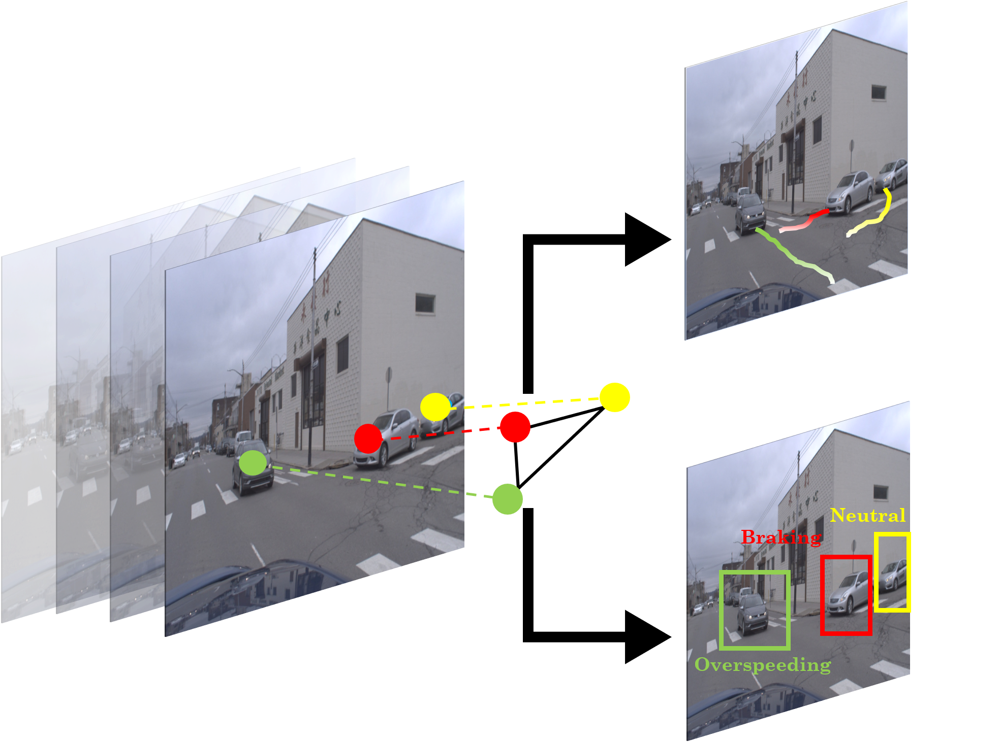
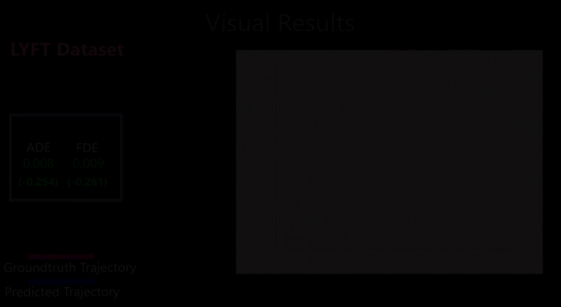
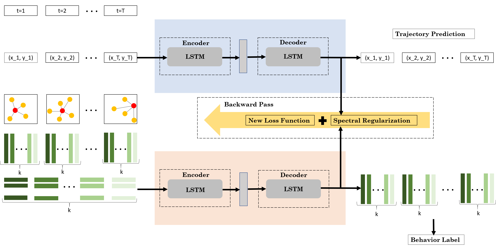
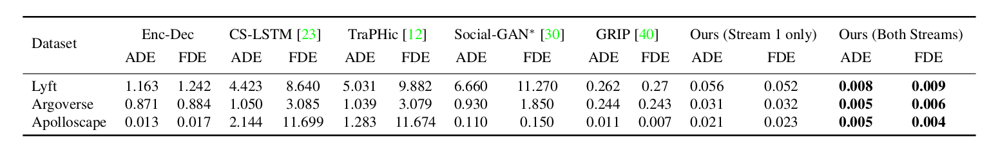
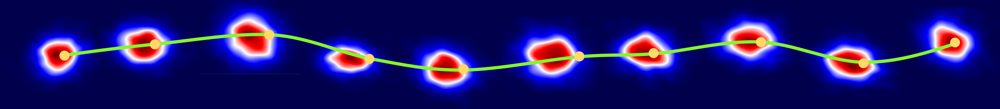
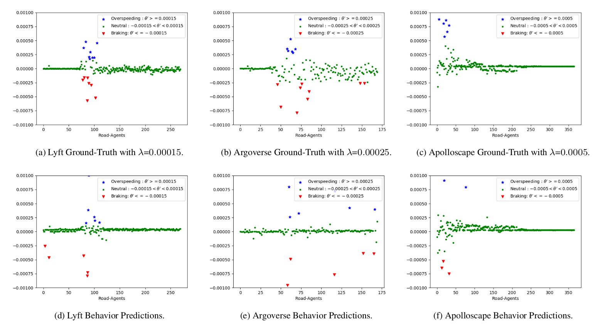
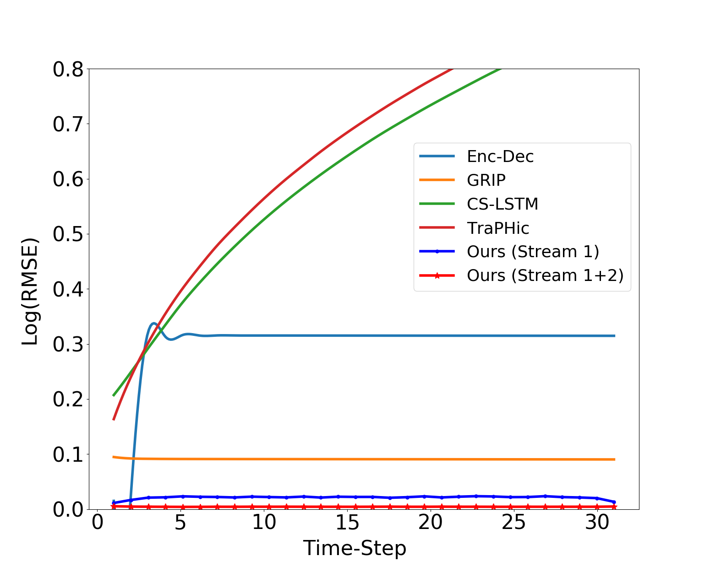
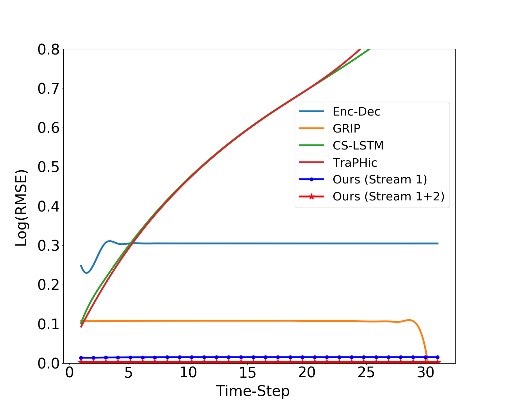
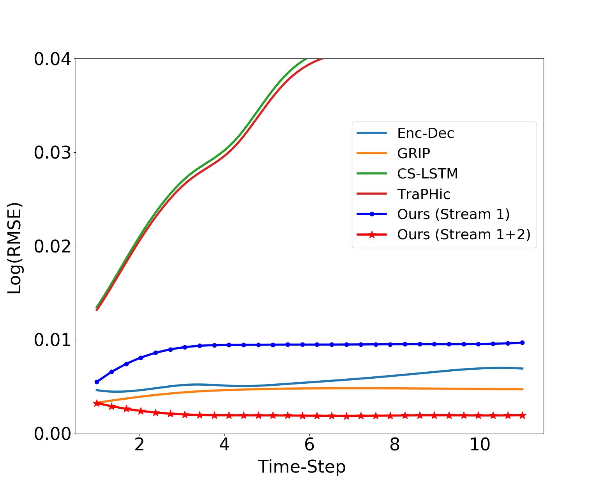

### SC-GLSTM 
SC-GLSTM algoritmasina dair ([**Forecasting Trajectory and Behavior of Road-Agents Using Spectral Clustering in Graph-LSTMs**](https://obj.umiacs.umd.edu/gamma-umd-website-imgs/pdfs/autonomousdriving/spectralcows_full.pdf)) calismalar bu repo'da toplanmistir.

SC-GLSTM projesine **https://gamma.umd.edu/spectralcows** uzerinden de ulasilabilir. 

Kodun alindigi repo: **https://github.com/rohanchandra30/Spectral-Trajectory-and-Behavior-Prediction**

State of the Art'a eristikleri bir takim veri setleri ve challenge'lar:
- Trajectory Prediction on Apolloscape 
- Trajectory Prediction on Argoverse
- Trajectory Prediction on Lyft Level 5

Sonuclar metre yerine normalized RMSE degerleri cinsinden verilmistir.

## Nasil Calistirilir  
Python 3.7 versiyonu uzerinde gelistirilmistir.
### Yukleme Islemleri
1. Conda cevresi olusturulur:
  `conda env create -f env.yml`
2. Cevre aktive edilir:
  `conda activate sc-glstm`
3. Ilgili kaynaklar indirilir:
  `python setup.py`

### Kullanim

* Gerceklenen metodun sundugu bir ve iki steam uzerine kurulu modelleri calistirmak icin:
  1. `cd ours/`
  2. `python main.py`
  3. Bir stream'den iki stream'e gecmek icin, `main.py` dosyasindaki `s1` degiskenini True/False olarak degistirmek gerekir.
  4. Modeli degistirmek icin, `main.py`'da bulunan  `DATA` ve `SUFIX` degiskenleri guncellenir.
* EncDec metodu karsilastirmasini calistirmak icin:  
  1. `cd comparison_methods/EncDec/`
  2. `python main.py`
  3. Modeli degistirmek icin, `main.py`'da bulunan  `DATA` ve `SUFIX` degiskenleri guncellenir.
* GRIP metodu karsilastirmasini calistirmak icin: 
  1. `cd comparison_methods/GRIP/`
  2. `python main.py`
  3. Modeli degistirmek icin, `main.py`'da bulunan  `DATA` ve `SUFIX` degiskenleri guncellenir.
* TraPHic/SC-LSTM metodu karsilastirmasini calistirmak icin: 
  1. `cd comparison_methods/traphic_sconv/`
  2. `python main.py`
  3. Modeli ve metodlari degistirmek icin, `main.py`'da bulunan `DATASET` ve `PREDALGO` degiskenleri guncellenir. 

### Karsilastirma Maksadiyla Gerceklenen Trajectory Prediction Metodlarinin Listesi

* [**TraPHic: Trajectory Prediction in Dense and Heterogeneous Traffic Using Weighted Interactions**, CVPR'19](https://gamma.umd.edu/researchdirections/autonomousdriving/traphic/)
* [**Convolutional Social Pooling for Vehicle Trajectory Prediction**, CVPRW'18](https://arxiv.org/pdf/1805.06771.pdf)
* [**Social GAN: Socially Acceptable Trajectories with Generative Adversarial Networks**, CVPR'18](https://arxiv.org/pdf/1803.10892.pdf)
* [**GRIP: Graph-based Interaction-aware Trajectory Prediction**, ITSC'19](https://arxiv.org/pdf/1907.07792.pdf)
    * SC-GLSTM algoritmasini gercekleyen gelistiriciler, GRIP yaklasimina dair kodun official implementation'i olmadigindan replica'sini urettiklerini ifade etmektedirler. Official Implementation asagidaki linkten saglanacaktir: https://github.com/xincoder/GRIP

### Kullanilan Veri Setleri 
* [**Argoverse**](https://www.argoverse.org/data.html) (input length: 20 & output length: 30)
* [**Apolloscape**](http://apolloscape.auto/trajectory.html) (input length: 6 & output length: 10)
* [**Lyft Level 5**](https://level5.lyft.com/dataset/)  (input length: 20 & output length: 30)

### Veri Hazirlama Sureci
Raw data'dan veri elde etme surecine dair adimlar burada ozetlenmistir.

#### Resmi Websitesinden Indirdikten Sonra Veri Setinin Formatlanmasi:
* `data_processing/format_apolloscape.py` kodu calistirilarak ApolloScape verisi istenen formata kavusturulur. 
* `data_processing/format_lyft.py` kodu calistirilarak Lyft verisi istenen formata kavusturulur.
* Run `data_processing/generate_data.py` kodu calistirilarak Argoverse Trajectory verisi istenen formata kavusturulur.

#### Formatlanmis Verinin Ilgili Veri Yapisi Icin Hazirlanmasi
* `data_processing/data_stream.py` kodu kullanilarak stream1 and stream2 icin input verisi olusturulur. 
* `data_processing/behaviors.py` kodundaki `generate_adjacency()` fonksiyonu kullanilarak yakinlik matrisleri olusturulur.
* Veriyi network'e aktarmadan evvel yapilmasi gereken bir islem: `data_processing/behaviors.py` kodundaki `add_behaviors_stream2()`  `add_behaviors_stream2()` fonksiyonu kullanilarak davranis label'lari stream2 verisine eklenir. Sonrasinda network'e stream2 saglanabilir.

### Gorsellestirme

* `data_processing/behaviors.py` kodundaki `plot_behaviors()` fonksiyonu kullanilarak agent'larin davranislari gorsellestirilebilir.

## SC-GLSTM Mimarisi

Network Mimarisi gorselinde, i'inci road-agent icin Trajectory ve Behavior Prediction gosterilmedektedir (Traffic Graphs kismindaki kirmizi daire). Input'ta, T saniyelik gecmise dair uzaysal koordinatlarin yani sira traffic-graph'larin  ilk T traffic-graph'a tekabul eden eigenvector'leri de barinmaktadir (yesil dikdortgenler, her bir yesil tonu eigenvector'un index'ini temsil etmektedir). Hakiki loss fonksiyonunu regularize etmek ve uzun vadeli tahmin kalitesini artirma maksadiyla yeni loss fonksiyonu uzerinde backpropagation islemi gerceklestirmek icin, Stream 2 blogundan edinilen tahmin edilmis eigenvector'lerin uzerinde Spectral clustering teknigi icra edilir.  

## Diger Modellerle Kiyaslamalar

## Bir Takim Sonuclar

### Trajectory Prediction Sonucu

### Behavior Prediction Sonuclari

  

## Veri Setlerine Gore RMSE Sonuclari 

#### Lyft 

  

#### Argoverse 

  

#### ApolloScape 

  

