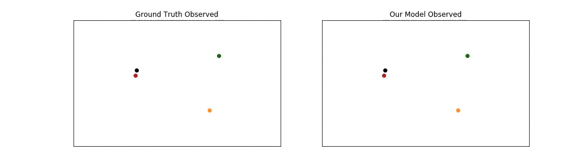
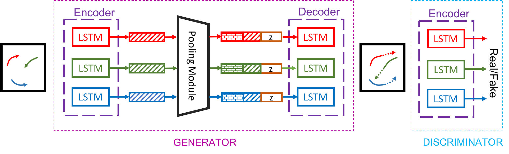
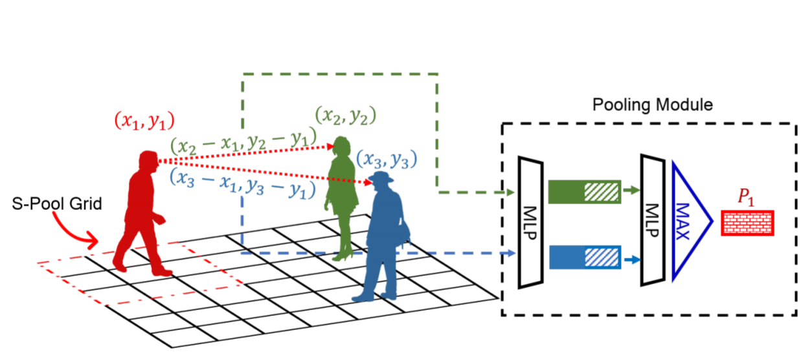
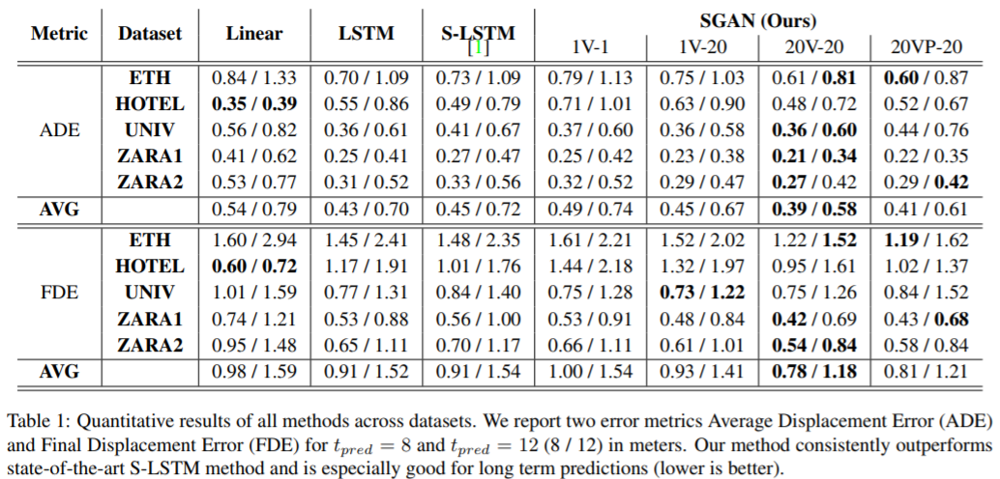

# Social GAN

Social GAN algoritmasının ([Social GAN: Socially Acceptable Trajectories with Generative Adversarial Networks](https://arxiv.org/abs/1803.10892), CVPR 2018) gerçeklenmesine dair çalışmalar bu repo'da toplanmıştır.
Kodun alındığı kaynak: https://github.com/agrimgupta92/sgan olarak belirtilebilir.

Normal şartlar altında, sosyal insan hareketi bireyler arasında gerçeklesen, birçok farklı davranışa evrilebilme potansiyeli olan ve sosyal adetlere uygun icra edilen bir süreçtir. Social GAN makalesinde, bahsi gecen bu karmaşık konuya dair bir yaklaşım sunulmuştur. Bu yaklaşımda, Sequence Prediction ve Generative Adversarial Networks konseptlerini birlikte kullanarak, bir recurrent sequence-to-sequence model elde edilmiştir. Bu model hareket geçmişlerini gözlemleyerek ve yayalara dair bilgileri toplama adına kullandığı pooling mekanizması sayesinde geleceğe dair davranışları kestirmeyi amaçlar. 
Asağıda, kompleks senaryolarda, model tarafından üretilmiş ve sosyal olarak kabul edilebilir olarak nitelendirilen tahminleri görmekteyiz. Her bir insan farklı bir renkle belirtilir. Gözlem verisi noktalarla, tahmin verisi yıldızlarla gösterilmektedir.
<div align='center'>
</img>
</img>
</div>

### 1. Model
Sunulan mimarı 3 kısımdan meydana gelmektedir. Generator (G), Pooling Module (PM) ve Discriminator (D). Generator yapısı, Encoder ve Decoder'a dair Hidden State'lerin Pooling Module aracılığıyla bağlandığı Encoder-Decoder çerçevesi üzerine oturur. Generator yapısı, bir mahalde bulunan yayalara dair trajectory'leri girdi olarak alır ve ilgili tahmin trajectory'lerini oluşturur. Discriminatör yapısı ise, tüm sekansı, yani hem input trajectory'lerini hem de bu trajectory'lere dair tahminleri bir arada edinir ve gerçek/sahte şeklinde sınıflandırır.
#### Mimari

#### Pooling Module

Makalede önerilen Pooling mekanizması (kırmızı noktalı okları) ile Social Pooling (kırmızı çizgili grid) yaklaşımının kırmızı insan için kıyaslanmasını görmekteyiz. Önerilen metod kırmızı insan ile diğer insanlar arasındaki relatif pozisyonları hesaplar. Bu pozisyonlar her bir insanın hidden state'ine peşpeşe (concatenate) eklenir. Sonrasında bir MLP tarafından bağımsız bir şekilde işlenir ve sonrasında elementwise pool'lanarak kırmızı insanın pooling vector'u (P1) hesaplanır. Social Pooling ise sadece grid içersindeki insanları hesaba katar ve her bir ikili arasındaki etkileşimi modelleyemez.


### 2. Setup
Bu çalışma Ubuntu 16.04 üzerinde, Python 3.5 ve PyTorch 0.4 ile gerçeklenmiştir. Kodun alındığı repo'da önerilen kurulum adımları su şekildedir.
```bash
python3 -m venv env               # Create a virtual environment
source env/bin/activate           # Activate virtual environment
pip install -r requirements.txt   # Install dependencies
echo $PWD > env/lib/python3.5/site-packages/sgan.pth  # Add current directory to python path
# Work for a while ...
deactivate  # Exit virtual environment
```

### 3. Pretrained Modeller
`bash download_models.sh` script'i ile pretrained modeller indirilebilir. Bu script asağıdaki modelleri indirecektir.
- `sgan-models/<dataset_name>_<pred_len>.pt`: 5 veri seti için toplam 10 adet pretrained model barındırmaktadır. Bu modeller aşağıdaki tabloların SGAN-20V-20 kısmına tekabül eder.
- `sgan-p-models/<dataset_name>_<pred_len>.pt`: 5 veri seti için toplam 10 adet pretrained model barındırmaktadır. Bu modeller asağıdaki tabloların SGAN-20VP-20 kısmına tekabül eder.
#### Karşılaştırma


Kendi yöntemlerini SGAN-kVP-N diye anmaktalar. kV ile vurgulanan modelin variety loss kullanılarak eğitilip eğitilmediğidir (k=1 variety loss yoktur demektir). P ise öne sürülen Pooling modülünün kullanılıp kullanılmadığını vurgular. Test sürecinde, nicel değerlendirme kapsamında, çoklu sample'lama yapılarak ve L2 normundaki en doğru tahmini kaale alarak ilerlenmiştir. Son olarak N, test sürecinde modelden kaç defa sample alındığını belirtmektedir. t\_pred = 8 ve 12 için, iki adet metre cinsinden error metriği raporlanmıştır: Average Displacement Error (ADE) and Final Displacement Error (FDE). Repo'daki kod, makaledeki sonuçlardan daha olumlu sonuçlar vermiştir. print\_args kullanarak eğitme sürecinde kullanılan hyperparameter'lar elde edilebilir. Makalede önerildiği üzere, SGAN-20VP-20 için, local yerine global kullanılmıştır.

**SGAN-20V-20**

| Model | ADE-8  |  ADE-12 | FDE-8  | FDE-12  |
|-----|-----|---    |---    |---   |
| `ETH`| 0.58 |0.71 |1.13 |1.29 |
| `Hotel`| 0.36 |0.48 |0.71 |1.02|
| `Univ`| 0.33 |0.56 |0.70 |1.18 |
| `Zara1`| 0.21 |0.34 |0.42 |0.69|
| `Zara2`| 0.21 |0.31|0.42 |0.64|

**SGAN-20VP-20**

| Model | ADE-8  |  ADE-12 | FDE-8  | FDE-12  |
|-----|-----|---    |---    |---   |
| `ETH`| 0.57 |0.77|1.14 |1.39|
| `Hotel`| 0.38 |0.43|0.73 |0.88|
| `Univ`| 0.42 |0.75|0.79 |1.50|
| `Zara1`| 0.22 |0.34|0.43 |0.68|
| `Zara2`| 0.24 |0.36|0.48 |0.73|


### 4. Modelleri Çalıştırmak İçin
`evaluate_model.py` script'i ile herhangi bir veri seti üzerinde pretrained modelleri çalıştırmak mümkündür. Tüm veri setleri için, karşılaştırma tablosundaki SGAN-20V-20 konfigürasyonundaki sonuçları elde etme adına aşağıdaki script çalıştırılır.
```bash
python evaluate_model.py --model_path models/sgan-models
```
### 5. Yeni Modellerin Eğitilmesi
Asağıdaki adımlar takip edilerek eğitme süreci gerçekleştirilebilir. 
#### 5.1. Veri Setlerinin Edinilmesi 
***bash scripts/download_data.sh*** çalıştırılarak veri setleri indirilir.
Script çalıştırıldığında `datasets/<dataset_name>` klasörü altında veri setleri `train/`, `val/`, `test/` ayrımı yapılmış halde bulunacaktır. Kullanılacak veri setleri, Dünya koordinatlarına -metrik sisteme- uygun olacak şekilde pre-process işlemi geçirmiştir. Çalışılan algoritma kapsamında 5 adet veri seti desteklenmektedir: ETH, ZARA1, ZARA2, HOTEL ve UNIV. 
Eğitme sürecinde kullanılan leave-one-out yaklaşımı uyarınca, her bir veri seti, 4 set training ve 1 set test icin kullanılmaktadır. Trajectory 8 zaman adımı boyunca gözlenir ve 8 veya 12 zaman adımı için tahmin üretilir. 1 zaman adımının 0.4 sn olduğu kabul edilmiş; 3.2 sn gözlemlenmiş ve 3.2 sn - 4.8 sn'lik tahminler oluşturulmuştur. 

#### 5.2. Eğitim Süreci
Veri seti indirildikten ve hazırlandıktan sonra ***python train*.*py*** script'i ile yeni model eğitilmesi sağlanır.
Bu script üzerinde yapılacak değişiklikler ile calışılacak veri seti değiştirilebilir. Script çalıştırıldıktan sonra periyodik bir biçimde checkpoint dosyaları oluşturulur (`checkpoint_with_model.pt` altında model ağırlıkları ve optimizer'in state'i barınır,  `checkpoint_no_model.pt` altında ise model ağırlıklarından vb arınmış görece sığ bir checkpoint tutulur).
Eğitme sürecine dair model mimarisini yapılandıracak, hyperparameter'ların ve I/O işlemlerinin ayarlanmasında kullanılacak birçok command-line flag mevcuttur.
##### 5.2.1. Optimizasyon
- `--batch_size`: Eğitim sürecinde her bir minibatch'te kaç adet sekans kullanılacağı. Varsayılan değer, 64.
- `--num_iterations`: Eğitim sürecinde kullanılacak iterasyon sayısı. Varsayılan değer, 10000.
- `--num_epochs`: Eğitim sürecinde kullanılacak iterasyon sayısı. Lakin bu defa epoch'lara bölünür. Her bir epoch içerisinde belirli sayıda iterasyon gerçekleştirilir. Varsayılan değer, 200.

##### 5.2.2. Veri Seti Ayarları

- `--dataset_name`: Eğitme sürecinde kullanılacak veri seti. Varsayılan set, `zara1`.
- `--delim`: Veri setinin dosyalarında kullanılacak ayraç. Varsayılan değer, `' '`.
- `--obs_len`: Girdi trajectory'lerde bulunacak zaman adımı miktarı. Varsayılan değer, 8. 
- `--pred_len`: Tahmin çıktılarında bulunacak zaman adımı miktari. Varsayılan değer, 8.
- `--loader_num_workers`: Veri yüklemede kullanılan arkaplan thread'lerinin sayısı. Varsayılan değer, 4.
- `--skip`: Veri setini oluştururken atlanacak frame miktari. Varsayılan değer, 1.

##### 5.2.3. Model Ayarları
Bahsi geçen model 3 ayrı bileşenden meydana gelmektedir.
-   Generator
-   Pooling Module
-   Discriminator

Aşağıdaki hyperparameter'lar hem generator hem de discriminator kısmı için geçerlilerdir.
- `--embedding_dim`: input (x, y) koordinatları için embedding layer'in boyutu. Varsayılan değer, 64.
- `--num_layers`: LSTM hücresindeki katmanların sayısı. Yalnızca num_layers = 1 destekleniyor. Multi-layer RNN yaklaşımı sağlanmamış durumda.
- `--dropout`: Dropout'u belirleyen Float değer. Varsayılan değer, 0 (no dropout).
- `--batch_norm`: Batch Normalization yapılıp yapılmadığına dair bir boolean flag. Varsayılan değer, False.
- `--mlp_dim`: MLP boyutlarını belirleyen değer. Varsayılan değer, 1024.

**Generator Ayarları**: Generator yapısı verilen sekans içerisindeki tüm trajectory'leri edinir ve simültane bir şekilde sosyal olarak kabul edilebilir trajectory'leri tahmin eder. Aşağıdaki flag'ler generator mimarisine özgü hyperparameter'ları kontrol etmektedir:
- `--encoder_h_dim_g`: Encoder'da bulunan hidden layer'ın boyutunu belirler. Varsayılan değer, 64.
- `--decoder_h_dim_g`: Decoder'da bulunan hidden layer'ın boyutunu belirler. Varsayılan değer, 64.
- `--noise_dim`: Decoder'ın input'una eklenen gürültünün boyutlarını tutan tuple. Varsayılan değer, None.
- `--noise_type`: Eklenecek gürültünün tipi. İki opsiyon destekleniyor: *uniform* ve *gaussian*. Varsayılan değer, *gaussian*.
- `--noise_mix_type`: Eklenen gürültü tüm yayalar için aynı olabileceği gibi her şahsa ayrı gürültü yaklaşımı da mümkün. Desteklenen opsiyonlar: *global* ve *ped*. Varsayılan değer, *ped*.
- `--clipping_threshold_g`: Gradient'lerin kırpılacağı eşiği belirten float değer. Varsayılan değer, 0.
- `--g_learning_rate`: Generator icin öğrenme katsayısı. Varsayılan değer, 5e-4. Kullanılan optimizer `Adam`.
- `--g_steps`: Generator üzerinde her bir iterasyonda gerçekleşecek g_steps miktarında forward backward pass gerçekleşir. Varsayılan değer, 1.

**Pooling Ayarları**: Jenerik tasarımları sayesinde herhangi bir pooling türü desteklenebilir. İki adet pooling modülü hali hazırda desteklenmekte: 
    
- Social Pooling 
- Pool Net. 

Aşağıdaki flag'ler pooling modülüne özgü hyperparameter'ları kontrol etmektedir:
- `--pooling_type`: Kullanılacak pooling modülünün tipi. "pool_net" ve "spool" desteklenmekte. Varsayılan ayar, "pool_net".
- `--pool_every_timestep`: Hidden state'ler her bir zaman adımında veya her bir obs_len adım atıldıktan sonra toplanabilir. Varsayılan değer, False.
- `--bottleneck_dim`: Pool Net adına Pool'lanan vektörün çıktı boyutu. Varsayılan değer, 1024.
- `--neighborhood_size`: Social Pooling için komşuluk bölgesi boyutu. S-LSTM makalesi bu konuyu açıklıyor. Varsayılan değer, 2.
- `--grid_size`: Komşuluk bölgesi grid_size \* grid_size grid'lere bölünmüştür. Varsayılan değer, 8.

**Discriminator Ayarları**: Aşağıdaki flag'ler discriminator mimarisine özgü hyperparameter'ları kontrol etmektedir:
- `--d_type`: Discriminator ya her bir trajectory'yi bağımsız bir şekilde ele alır ya da generator mantığına yakın bir şekilde tüm trajectory'lere dair bilgi pool'lanır ve ilgili konfigürasyonun gerçek mi sahte mi olduğuna dair karar verilir. Birincisi *local*, ikincisi *global* ayarlardır. Varsayılan ayar, "local".
- `--encoder_h_dim_d`:  Encoder'da bulunan hidden layer'ın boyutunu belirler. Varsayılan değer, 64.
- `--d_learning_rate`: Discriminator için öğrenme katsayısı. Varsayılan değer, 5e-4. Kullanılan optimizer `Adam`.
- `--d_steps`: Discriminator üzerinde her bir iterasyonda gerçekleşecek d_steps miktarında forward backward pass gerçekleşir. Varsayılan değer, 2.
- `--clipping_threshold_d`: Gradient’lerin kırpılacağı eşiği belirten float değer. Varsayılan değer, 0.

##### 5.2.4. Output Ayarları
Aşağıdaki flag'ler training script'inin çıktılarını kontrol etmektedir:
- `--output_dir`: Checkpoint'lerin kaydedileceği dizin. Varsayılan ayar, mevcut dizin.
- `--print_every`: Eğitme sürecindeki loss'ların yazdırılma ve kayıt edilme aralığı. Varsayılan değer, 10 (her 10 iterasyonun ardından).
- `--timing`: Eğer bu flag 1'e eşitlenirse zaman ölçülür ve print edilir.
- `--checkpoint_every`: Her `N` iterasyonda bir kaydetme işlemi gerçekleştirilir. Varsayılan değer, 100. Her bir checkpoint, training loss'larını, ADE ve FDE errorlerini, generator/discriminator ve optimizer state'lerini, ve eğer eğitme süreci sekteye uğrarsa kaldığı yerden devam edebilmesi için gereken diğer bilgiler tutulur.
- `--checkpoint_name`: Kaydedilen checkpoint'ler için base dosya ismi; varsayılan değer 'checkpoint'.
- `--restore_from_checkpoint`: Rutin davranış sıfırdan eğitmek ve eğer mevcutsa output checkpoint path'inin üzerine yazmaktır. Eğer bu flag 1'e eşitse, bulunan checkpoint dosyası ile eğitme sürecine kalınan yerden devam edilir.
- `--checkpoint_start_from`: Eğer bu flag aktifse verilen checkpoint noktasında eğitme sürecine devam edilir. Bu flag `--restore_from_checkpoint` flag'ine ağır basar, eğer her ikisi de aktifse.
- `--num_samples_check`: Training veri seti üzerinde metrikler hesaplanırken, değerlendirmek için istenilen örnek sayısını limitleyebiliriz.
